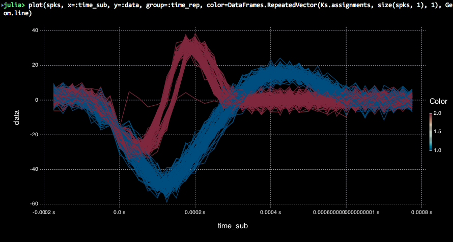

# AxisArrays

[](https://travis-ci.org/JuliaArrays/AxisArrays.jl) [](https://coveralls.io/github/JuliaArrays/AxisArrays.jl?branch=master)

This package for the Julia language provides an array type (the `AxisArray`) that knows about its dimension names and axis values.
This allows for indexing with the axis name without incurring any runtime overhead.
AxisArrays can also be indexed by the values of their axes, allowing column names or interval selections.
This permits one to implement algorithms that are oblivious to the storage order of the underlying arrays.
In contrast to similar approaches in [Images.jl](https://github.com/timholy/Images.jl) and [NamedArrays.jl](https://github.com/davidavdav/NamedArrays), this allows for type-stable selection of dimensions and compile-time axis lookup.  It is also better suited for regularly sampled axes, like samples over time.

Collaboration is welcome! This is still a work-in-progress. See [the roadmap](https://github.com/JuliaArrays/AxisArrays.jl/issues/7) for the project's current direction.

## Example of currently-implemented behavior:

```julia
julia> Pkg.clone("https://github.com/JuliaArrays/AxisArrays.jl")
       using AxisArrays, Unitful
       import Unitful: s, ms, µs

julia> fs = 40000 # Generate a 40kHz noisy signal, with spike-like stuff added for testing
       y = randn(60*fs+1)*3
       for spk = (sin.(0.8:0.2:8.6) .* [0:0.01:.1; .15:.1:.95; 1:-.05:.05]   .* 50,
                  sin.(0.8:0.4:8.6) .* [0:0.02:.1; .15:.1:1; 1:-.2:.1] .* 50)
           i = rand(round(Int,.001fs):1fs)
           while i+length(spk)-1 < length(y)
               y[i:i+length(spk)-1] += spk
               i += rand(round(Int,.001fs):1fs)
           end
       end

julia> A = AxisArray([y 2y], Axis{:time}(0s:1s/fs:60s), Axis{:chan}([:c1, :c2]))
2-dimensional AxisArray{Float64,2,...} with axes:
    :time, 0.0 s:2.5e-5 s:60.0 s
    :chan, [:c1,:c2]
And data, a 2400001x2 Array{Float64,2}:
 -3.06091    -6.12181
  0.152334    0.304668
  7.86831    15.7366
 -1.4144     -2.82879
 -2.02881    -4.05763
  9.87901    19.758
  ⋮
 -0.0254444  -0.0508888
  0.204358    0.408717
 -4.80093    -9.60186
  5.39751    10.795
  0.976276    1.95255
  0.336558    0.673116
```

AxisArrays behave like regular arrays, but they additionally use the axis
information to enable all sorts of fancy behaviors. For example, we can specify
indices in *any* order, just so long as we annotate them with the axis name:

```jl
julia> A[Axis{:time}(4)]
2-dimensional AxisArray{Float64,1,...} with axes:
    :chan, Symbol[:c1,:c2]
And data, a 2-element Array{Float64,1}:
 -1.4144  -2.82879

julia> A[Axis{:chan}(:c2), Axis{:time}(1:5)]
1-dimensional AxisArray{Float64,1,...} with axes:
    :time, 0.0 s:2.5e-5 s:0.0001 s
A[Axis{:chan}(:c2), Axis{:time}(1:5)]:
 -6.12181
  0.304668
 15.7366
 -2.82879
 -4.05763
```

We can also index by the *values* of each axis using an `Interval` type that
selects all values between two endpoints `a .. b` or the axis values directly.
Notice that the returned AxisArray still has axis information itself... and it
still has the correct time information for those datapoints!

```jl
julia> A[40µs .. 220µs, :c1]
1-dimensional AxisArray{Float64,1,...} with axes:
    :time, 5.0e-5 s:2.5e-5 s:0.0002 s
And data, a 7-element Array{Float64,1}:
  7.86831
 -1.4144
 -2.02881
  9.87901
  0.463201
  2.49211
 -1.97716

julia> axes(ans, 1)
AxisArrays.Axis{:time,StepRangeLen{Quantity{Float64, Dimensions:{𝐓}, Units:{s}},Base.TwicePrecision{Quantity{Float64, Dimensions:{𝐓}, Units:{s}}},Base.TwicePrecision{Quantity{Float64, Dimensions:{𝐓}, Units:{s}}}}}(5.0e-5 s:2.5e-5 s:0.0002 s)
```

You can also index by a single value on an axis using `atvalue`. This will drop
a dimension. Indexing with an `Interval` type retains dimensions, even
when the ends of the interval are equal:

```jl
julia> A[atvalue(2.5e-5s), :c1]
-1.6820949242530765

julia> A[2.5e-5s..2.5e-5s, :c1]
1-dimensional AxisArray{Float64,1,...} with axes:
    :time, 2.5e-5 s:2.5e-5 s:2.5e-5 s
And data, a 1-element Array{Float64,1}:
 -1.68209
```

Sometimes, though, what we're really interested in is a window of time about a
specific index. One of the operations above (looking for values in the window from 40µs
to 220µs) might be more clearly expressed as a symmetrical window about a
specific index where we know something interesting happened. To represent this,
we use the `atindex` function:

```jl
julia> A[atindex(-90µs .. 90µs, 5), :c2]
1-dimensional AxisArray{Float64,1,...} with axes:
    :time_sub, -7.5e-5 s:2.5e-5 s:7.5e-5 s
And data, a 7-element SubArray{Float64,1,Array{Float64,2},Tuple{AxisArrays.AxisArray{Int64,1,UnitRange{Int64},Tuple{AxisArrays.Axis{:sub,SIUnits.SIRange{FloatRange{Float64},Float64,0,0,1,0,0,0,0,0,0}}}},Int64},0}:
 15.7366
 -2.82879
 -4.05763
 19.758
  0.926402
  4.98423
 -3.95433
```

Note that the returned AxisArray has its time axis shifted to represent the
interval about the given index!  This simple concept can be extended to some
very powerful behaviors. For example, let's threshold our data and find windows
about those threshold crossings.

```jl
julia> idxs = find(diff(A[:,:c1] .< -15) .> 0)
242-element Array{Int64,1}: ...

julia> spks = A[atindex(-200µs .. 800µs, idxs), :c1]
2-dimensional AxisArray{Float64,2,...} with axes:
    :time_sub, -0.000175 s:2.5e-5 s:0.000775 s
    :time_rep, Quantity{Float64, Dimensions:{𝐓}, Units:{s}}[0.178725 s,0.806825 s,0.88305 s,1.47485 s,1.50465 s,1.53805 s,1.541025 s,2.16365 s,2.368425 s,2.739 s  …  57.797925 s,57.924075 s,58.06075 s,58.215125 s,58.6403 s,58.96215 s,58.990225 s,59.001325 s,59.48395 s,59.611525 s]
And data, a 39x242 Array{Float64,2}:
 -1.53038     4.72882     5.8706    …  -0.231564      0.624714   3.44076
 -2.24961     2.12414     5.69936       7.00179       2.30993    5.20432
  5.96311     3.9713     -4.38335       1.32617      -0.686648   0.443454
  3.86592     5.7466      2.32469       1.30803       3.44585    1.17781
  3.56837    -3.32178     1.16106      -3.91796       2.41779   -6.17495
 -9.52063    -2.07014    -1.18463   …  -3.55719       2.23117    1.76089
  ⋮                                 ⋱                 ⋮
  3.51708    -1.63627     0.281915     -2.41759       3.39403    0.101004
  0.0421772  -2.13557    -4.71965       0.066912      3.25141   -0.445574
  3.53238    -3.72221     1.68314   …  -4.15147      -5.25241   -1.77557
 -4.38307     1.38275    -1.33641       3.40342       0.272826  -3.22013
  2.54846    -0.0194032   2.58679      -0.000676503  -2.71147   -0.288483
  0.260694   -4.1724     -0.111377      3.283         1.77147   -0.367888
```

By indexing with a repeated interval, we have *added* a dimension to the
output! The returned AxisArray's columns specify each repetition of the
interval, and each datapoint in the column represents a timepoint within that
interval, adjusted by the time of the theshold crossing. The best part here
is that the returned matrix knows precisely where its data came from, and has
labeled its dimensions appropriately. Not only is there the proper time
base for each waveform, but we also have recorded the event times as the axis
across the columns.

Now we can do a cursory clustering analysis on these spike snippets to separate
the two "neurons" back out into their own groups with Clustering.jl, and plot
using Gadfly.

```jl
julia> using Clustering
       Ks = Clustering.kmeans(spks.data, 2);

julia> using Gadfly
       plot(spks, x=:time_sub, y=:data, group=:time_rep, color=DataFrames.RepeatedVector(Ks.assignments, size(spks, 1), 1), Geom.line)
```




## Indexing

### Indexing axes

Two main types of Axes supported by default include:

* Categorical axis -- These are vectors of labels, normally symbols or
  strings. Elements or slices can be selected by elements or vectors
  of elements.

* Dimensional axis -- These are sorted vectors or iterators that can
  be selected by `Intervals`. These are commonly used for sequences of
  times or date-times. For regular sample rates, ranges can be used.

Here is an example with a Dimensional axis representing a time
sequence along rows and a Categorical axis of symbols for column
headers.

```julia
B = AxisArray(reshape(1:15, 5, 3), .1:.1:0.5, [:a, :b, :c])
B[Axis{:row}(Interval(.2,.4))] # restrict the AxisArray along the time axis
B[Interval(0.,.3), [:a, :c]]   # select an interval and two of the columns
```

User-defined axis types can be added along with custom indexing
behaviors.

### Example: compute the intensity-weighted mean along the z axis
```julia
B = AxisArray(randn(100,100,100), :x, :y, :z)
Itotal = sumz = 0.0
for iter in eachindex(B)  # traverses in storage order for cache efficiency
    I = B[iter]  # intensity in a single voxel
    Itotal += I
    sumz += I * iter[axisdim(B, Axis{:z})]  # axisdim "looks up" the z dimension
end
meanz = sumz/Itotal
```

The intention is that all of these operations are just as efficient as they would be if you used traditional position-based indexing with all the inherent assumptions about the storage order of `B`.
